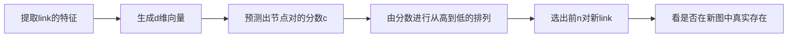

# Task02 传统图机器学习与特征工程
**即首先进行人工的特征工程学习出d维向量，然后再使用传统的机器学习方法。d维向量主要由节点特征、连接特征、子图或者全图特征构成。在本文中，不涉及节点的属性特征，比如节点代表一个人的话，他的收入、学历等特征，主要以其拓扑结构中连接的边来表示其节点特征。**
## 一、节点层面的特征工程
主要包括四个方面
* 节点度数
* 中心度(Node Centrality)
* 聚集系数
* 子图(Graphlets)

### 1.节点度数
就是每个节点连接的边数目。只能表示数量，不能表示质量。
### 2.节点中心度
节点中心度包含三个部分：特征向量中心度、中间点中心度和距离中心度
#### a 特征向量中心度(Eigenvector Centrality)
- 基本思想：节点 $v$ 的重要程度取决于它邻居的重要程度
- 基本公式： $c_{v} = \frac{1}{\lambda} \sum\limits_{u \in N(v)}^{} c_{u}$， $\lambda$ 是一个常数
- 问题分析：这是一个递归问题。需要初始值，为了不去这样求解，进行了转化
- 问题转化：图中所有节点特征向量中心度组成的向量 $\boldsymbol c$ ，转化为： $\lambda \boldsymbol c = A \boldsymbol c$， $A$ 为图的邻接矩阵，则变为了求图的邻接矩阵的特征向量和特征值的问题。
- 问题再分析：这里很让人疑惑。

## 二、连接层面的特征工程
通过已知连接来补全未知的连接。

有两种形式：

- 直接提取link的特征，并将其变为d维的向量
- ~~把link两端节点的d维向量拼接在一起~~(会丢失link本身的连接结构信息，不采用)

### 1.处理随机丢失的连接
是静态图的问题，图是不变的，随机删除一组图中的连接并预测它们。

### 2.处理随时间变化的连接
图是随时间变化的，比如人的社交网络，推荐系统等，给出图在 $[t_0, t_0']$ 时间段内的连接，预测图在 $[t_1, t_1']$ 时间段内的连接。

**评估的方式**：预测出L个连接，从其中选出Top n个连接，再与真实的n个连接作比较。

**具体过程**：

### 3.link层面的特征分类
**分为三种类型，基于两节点间距离、基于两节点的局部连接信息和机遇两节点的全图连接信息。**
#### a 基于两节点间的距离信息
两节点间的最短路径长度。只能表示路径长度，无法表示出邻节点的重叠情况。
#### b 基于两节点的局部连接信息
主要捕捉两个节点的共同相邻节点的信息

- 共同邻节点个数
- 交并比
- Adamic-Adar index（主要看它们的共同邻句是不是社牛，如果是的话那这两个节点的连接较弱，因为社牛的社交面很广）

计算方法：

缺点：
如果两个节点之间无共同的邻节点，则上述所有方法都是0了。

#### c 基于两节点的全图连接信息
主要是Katz系数：用于计算节点u和节点v之间长度为k的路径个数。

计算方法：计算邻接矩阵的k次幂，则临界矩阵的第u行第v列就是其katz系数 $P_{uv}^k$。

例如：

## 三、全图层面的特征工程
**目的是要把整个图变为一个d维向量，这个向量可以表示整个图的结构特点。**

### 1.主要方法
传统的全图层面的预测常使用核方法，设计核从而代替设计特征向量。关于什么是核方法，我觉得这里不用深究，只要知道后面用的核方法的流程就可以了。**图的核的目的是用来度量两个图之间的相似度。** 常用的方法为：Graphlet kernel和Weisfeiler-Lehman kernel。

主要的方向是使用类似[词袋模型](https://blog.csdn.net/Elenstone/article/details/105134863)(Bag-of-Words)的方法，词袋模型：像是句子或是文件这样的文字可以用一个袋子装着这些词的方式表现，这种表现方式不考虑文法以及词的顺序。简而言之就是统计每个词出现的次数。

- bag-of-nodes：将节点视为词，统计第i个节点是否存在。但是这种方法无法区分节点个数相同的图。例如：
    
- bag-of-node-degree：将节点的度数视为词。例如：
    
- bag-of-graphlets：看图中不同子图的个数。与节点的graphlets的区别：
  - 可以存在孤立节点
  - 计数全图的子图个数而非特定节点邻域的子图个数
例如：

从而通过给定图G，以及其子图的列表 $G_k=(g_1,g_2,...,g_{n_k})$，可以定义出其子图向量 $f_G$，$(f_G)_i=num of (g_i \subseteq G) \quad for i=1,2,...,n_k$，其中 $(f_G)_i$ 是第i个子图在全图中的个数（首先指定是有几个节点的子图）。

### 2.graphlet kernel
两个图，$G$ 和 $G'$，可以计算出其graphlet kernel：
$$
K(G,G') = f_G^Tf_G'
$$
如果两个图不一样大，则需要进行归一化：
$$
h_G = \frac{f_G}{sum(f_G)}\quad K(G,G') = h_G^Th_G'
$$
存在的问题：计算量大。

### 3.W-L kernel
可以解决计算量大的问题。方法：颜色微调。

直接给出例子：

